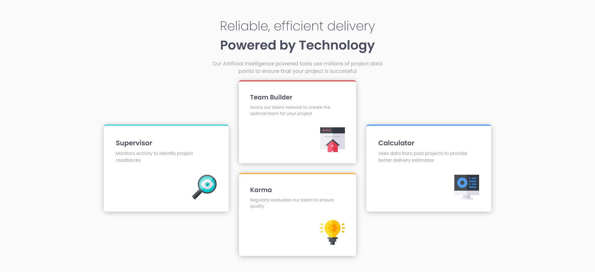
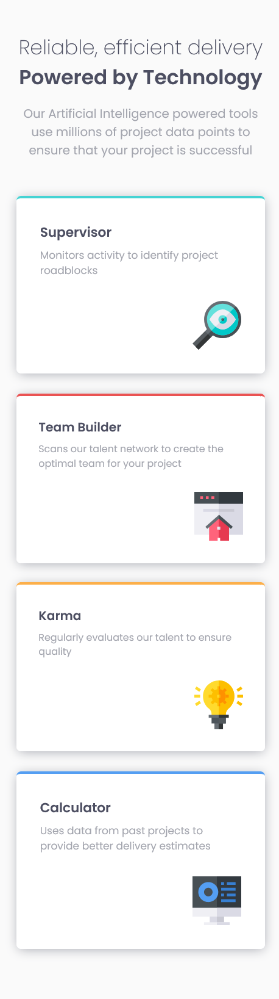

# Frontend Mentor - Four card feature section solution

This is a solution to the [Four card feature section challenge on Frontend Mentor](https://www.frontendmentor.io/challenges/four-card-feature-section-weK1eFYK). Frontend Mentor challenges help you improve your coding skills by building realistic projects. 

## Table of contents

- [Overview](#overview)
  - [The challenge](#the-challenge)
  - [Screenshot](#screenshot)
  - [Links](#links)
- [My process](#my-process)
  - [Built with](#built-with)
- [Author](#author)

## Overview

### The challenge

Users should be able to:

- View the optimal layout for the app depending on their device's screen size.

### Screenshot
| Desktop version                              |               Mobile Version                |
| -------------------------------------------- | :-----------------------------------------: |
|  |  |

### Links

- Solution URL: [Solution URL](https://www.frontendmentor.io/solutions/four-card-feature-section-IAJuEiVfhr)
- Live Site URL: [Live site URL](https://mahdisohaily.github.io/Four-card-feature-section/)

## My process

### Built with

- Semantic HTML5 markup
- CSS custom properties
- Flexbox
- CSS Grid
- Mobile-first workflow
- [sass](https://sass-lang.com/) - CSS preprocessor
- [vite.js](https://vitejs.dev/) - Vite is a build tool
## Author

- Frontend Mentor - [@MahdiSohaily](https://www.frontendmentor.io/profile/MahdiSohaily)
- Twitter - [@Mahdi_Rezaei_AF](https://twitter.com/Mahdi_Rezaei_AF)
